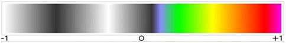

# Plant Health Measurement Device using NDVI

Being that changes in plant health may not be present upon visual inspection alone, it is necessary to have a cost-efficient method of visualizing plant health. This will result in increased awareness of declining plant health for common plant applications and allow for preemptive intervention efforts by the owner or overseer. 

**NDVI Color Scale Used:**




### Created By New Mexico State University ECE Students

* Jessi Jo Gonzales
* Ryan Levendosky
* Jose Olivarez
* Derrick Rivera
* **Mentor:**  Dr. Charles Creusere


## Getting Started

These instructions will get you a copy of the project up and running on your local machine for development and testing purposes. See deployment for notes on how to deploy the project on a live system.


### Hardware 

This software was designed and implemented using the following hardware:
* RaspberryPi 3 B+
* 16GB Micro SD Card
* Pi NoIR Camera V2 
* Roscolux #2007 Storaro Blue filter
* Pi Camera V2
* IVPort V2 Pi Camera Multiplexer 
* Waveshare 7" Touchscreen Display
* 3W Infrared Illuminator (2)
* RAVPower 22000mAH 4.5A Portable Phone Power Pack


### Installing Software

A step-by-step series that tells you how to get a Plant Health imaging software running

[Install git](https://projects.raspberrypi.org/en/projects/getting-strated-with-git/4)

[Introduction to git](https://product.hubspot.com/blog/git-and-github-tutorial-for-beginners)

Install the dependencies:
```
chmod +x install.sh
./install.sh
pip install -r requirements.txt
```
[Install IVPort-v2](https://github.com/ivmech/ivport-v2)

[Install picamera](https://github.com/waveform80/picamera) 

[Install OpenCV for C++](https://docs.opencv.org/trunk/d7/d9f/tutorial_linux_install.html)


## Deployment

This is where we add additional notes about how to deploy this on a live system


## Built With

**Python Packages**

* six
* wheel
* setuptools
* numpy
* matplotlib
* pillow
* opencv-python
* scikit-image
* imageio
* wxPython 

**C++ Libraries**

* OpenCV


## Acknowledgments

* Hat tip to anyone who's code was used
* Inspiration
* etc
